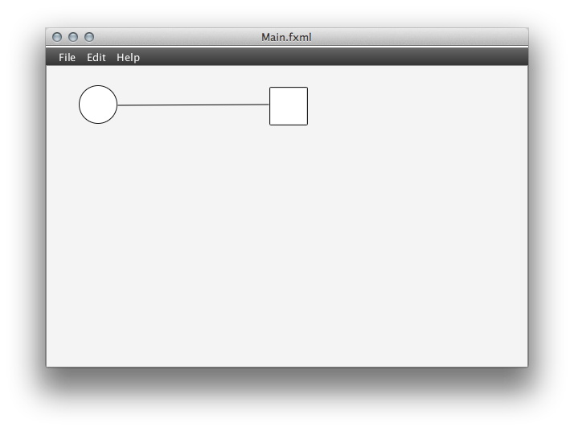

# GoodTool

## What is GoodTool?

GoodTool makes system monitoring easier than **ever before** and is available for _Windows_ and _Linux_ operating systems.

## Features

* Fast
* Secure
* Easy-to-work-with GUI

## Download

- Version [1.0][2]
- Version [0.9][1]
- Version [0.8](http://nequissimus.github.com/goodtool/0_8.zip "Link to 0.8")

## Installation

1. Download GoodTool
2. Execute .exe or .sh file
3. Follow screen instructions

## Screenshot

## API examples

### Access to API factory (Java)

Get the API factory: `GoodTool api = GoodTool.getAPI();`

### Usage of API factory (Java)

Set monitoring of only one CPU thread:

    GoodTool api = GoodTool.getAPI();
    api.setMonitoredThreads(1);

## Contact

Go to our website <http://nequissimus.com/> or email to <steinbach.tim@googlemail.com>

[1]: http://nequissimus.github.com/goodtool/0_9.zip "Link to 0.9"
[2]: http://nequissimus.github.com/goodtool/1_0.zip "Link to 1.0"

