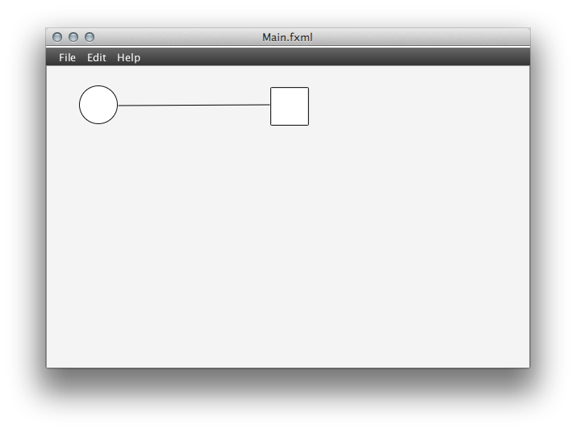

!SLIDE

# GoodTool

!SLIDE

## What is GoodTool?

GoodTool makes system monitoring easier than **ever before** and is available for _Windows_ and _Linux_ operating systems.

!SLIDE bullets incremental

## Features

* Fast
* Secure
* Easy-to-work-with GUI

!SLIDE bullets incremental

## Installation

1. Download GoodTool
2. Execute .exe or .sh file
3. Follow screen instructions

!SLIDE center

!SLIDE

## API examples

!SLIDE code

### Access to API factory (Java)

Get the API factory: `GoodTool api = GoodTool.getAPI();`

!SLIDE code

### Usage of API factory (Java)

Set monitoring of only one CPU thread:
    GoodTool api = GoodTool.getAPI();
    api.setMonitoredThreads(1);

!SLIDE

## Contact

Go to our website <http://nequissimus.com/> or email to <steinbach.tim@googlemail.com>
